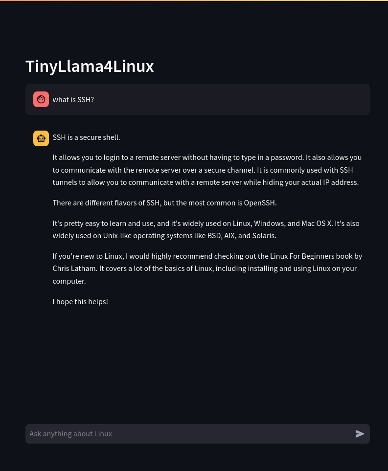

# TinyLlama-Linux-QA

## Overview
TinyLlama-Linux-QA is a specialized question-answering model designed to handle Linux-related queries. It is based on the TinyLlama architecture and has been fine-tuned on a dataset of Linux questions and answers.



## Dataset
The model has been trained on a dataset that includes a wide range of Linux-related questions, covering topics such as system administration, command-line usage, shell scripting, and more. The dataset is designed to provide comprehensive coverage of common Linux tasks and issues.

The data is accessible within this repository, or through [kaggle](https://www.kaggle.com/datasets/tiamatt/reddit-curated-linux-qna).

## Training

Training was performed using [Unsloth](https://unsloth.ai/) for memory-efficient and faster fine-tuning. Training machine specifications:
| **Attribute** | **Details** |
| ---------- | -------------------------- |
| **Base Model** | [TinyLlama-1.1B-Chat-v1.0](https://huggingface.co/TinyLlama/TinyLlama-1.1B-Chat-v1.0) |
| **GPU** | NVIDIA RTX 3050Ti 4GiB |
| **Memory** | 16GiB |
| **Nvidia Driver version** | 570.153.02 |
| **CUDA version** | 12.8 |
| **Python version** | 3.12.4 |
| **Kernel** | 6.14.7-arch2-1 |

The model has been uploaded to Hugging Face and is available for use under the model ID [tiam4tt/TinyLlama-1.1B-chat.v1.0-linux-qna](https://huggingface.co/tiam4tt/TinyLlama-1.1B-chat.v1.0-linux-qna)

## Usage

To use the TinyLlama-Linux-QA model, you can load it using the Hugging Face Transformers library. Here is an example of how to do this:

```python
from transformers import AutoModelForCausalLM, AutoTokenizer
model_name = "tiam4tt/TinyLlama-1.1B-chat.v1.0-linux-qna"
model = AutoModelForCausalLM.from_pretrained(model_name, device_map="auto", torch_dtype="auto")
tokenizer = AutoTokenizer.from_pretrained(model_name)
```
You can then use the model to generate answers to Linux-related questions by providing a prompt and using the `generate` method.

```python
prompt = "What is the command to list files in a directory?"
inputs = tokenizer(prompt, return_tensors="pt").to(model.device)
outputs = model.generate(**inputs, max_new_tokens=128)
answer = tokenizer.decode(outputs[0], skip_special_tokens=True)
print(answer)
```

## Run with Streamlit

To run the model with Streamlit, change directory to `app`

```bash
cd app
```
Then, install the required dependencies:
```bash
pip install -r requirements.txt
```
Finally, run the Streamlit app:
```bash
streamlit run app.py
```


## Note
*As of 01/06/2025, **Unsloth** has compatiblity issues with GPUs whose architecture is before Ampere (e.g., T4, V100, etc.). This is because the current version of `triton` 3.3.0 raises errors when computing fp16 on bf16-incompatible devices, if you encounter such case, downgrading `triton` to version **3.2.0** might be able to address the problem.*